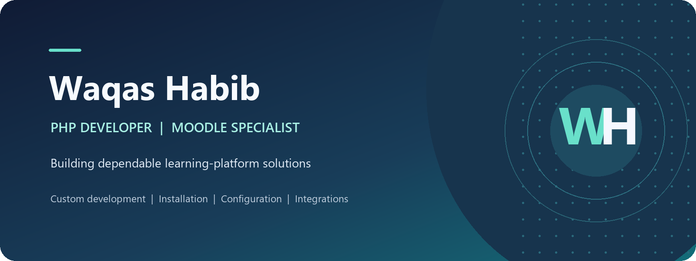

# Waqas Habib

**PHP & Full-Stack Developer | Moodle | Laravel | Docker**

Independent PHP development, Moodle tools, and web applications

I build practical web software with PHP, Laravel, and Moodle. My work includes custom Moodle plugins and features, web applications, integrations, platform configuration, upgrades, maintenance, and technical troubleshooting. I also use Docker-based workflows for development and testing.

I have worked independently with Laravel since 2024 and began working with Moodle in 2026. I focus on maintainable implementations, clear scope, and practical handover for the people who operate the software. For project enquiries, we agree scope, availability, and terms before work begins.

**Contact:** [waqashabib554@gmail.com](mailto:waqashabib554@gmail.com)

## Professional profiles

- [LinkedIn](https://www.linkedin.com/in/waqas-habib-48a6bb440/)
- [X](https://x.com/WaqasHabib554)
- [Reddit](https://www.reddit.com/user/Waqas554/)
- [Pinterest](https://www.pinterest.com/waqashabib554/)
- [DEV Community](https://dev.to/waqas_habib_eda6edc304cba)
- [Moodle Marketplace publisher profile](https://marketplace.moodle.com/user/31575)

## Areas of work

- PHP and Laravel web application development
- Custom Moodle plugin and feature development
- Moodle installation, configuration, upgrades, and maintenance
- Platform integrations and Docker-based development/testing
- PHP development and technical troubleshooting
- Administrator guidance and knowledge transfer

# Waqas Habib

**PHP & Full-Stack Developer | Moodle | Laravel | Docker**

Independent PHP development, Moodle tools, and web applications

I build practical web software with PHP, Laravel, and Moodle. My work includes custom Moodle plugins and features, web applications, integrations, platform configuration, upgrades, maintenance, and technical troubleshooting. I also use Docker-based workflows for development and testing.

I have worked independently with Laravel since 2024 and began working with Moodle in 2026. I focus on maintainable implementations, clear scope, and practical handover for the people who operate the software. For project enquiries, we agree scope, availability, and terms before work begins.

**Contact:** [waqashabib554@gmail.com](mailto:waqashabib554@gmail.com)

## Areas of work

- PHP and Laravel web application development
- Custom Moodle plugin and feature development
- Moodle installation, configuration, upgrades, and maintenance
- Platform integrations and Docker-based development/testing
- PHP development and technical troubleshooting
- Administrator guidance and knowledge transfer

